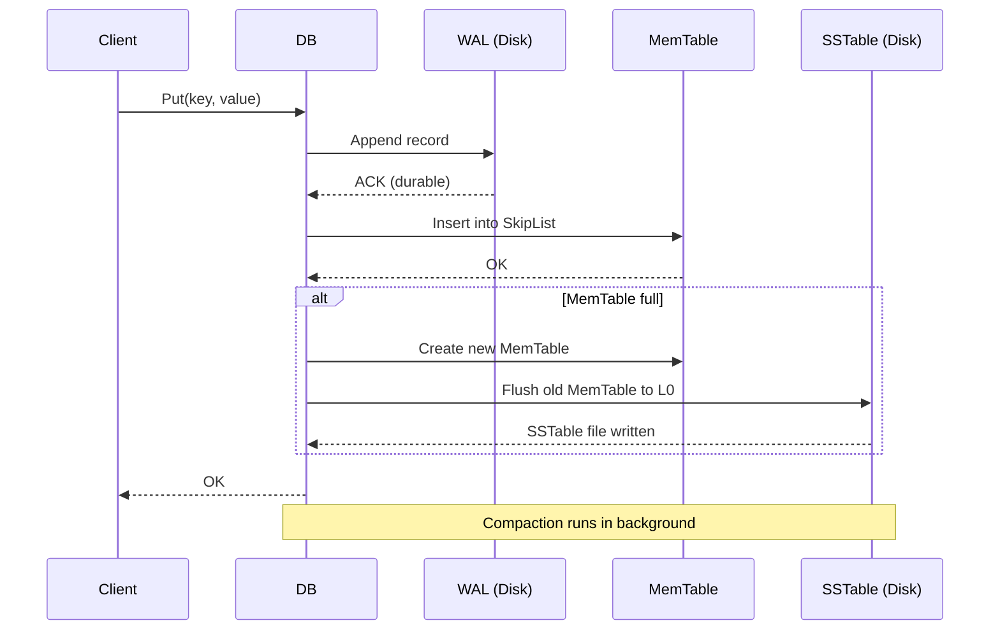
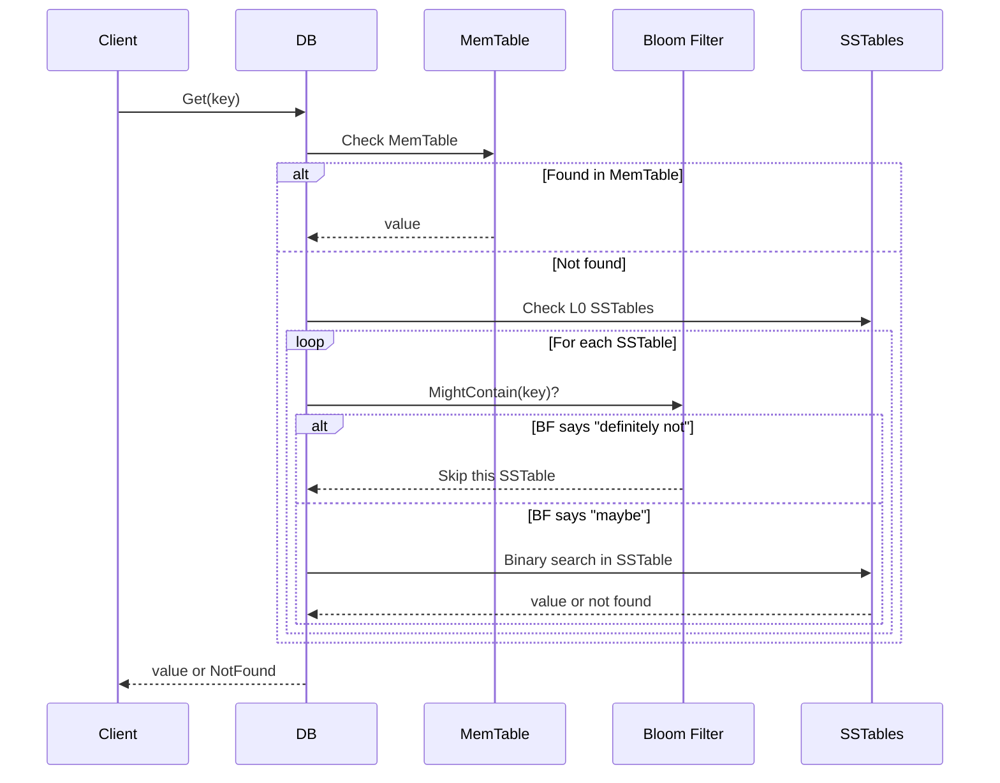
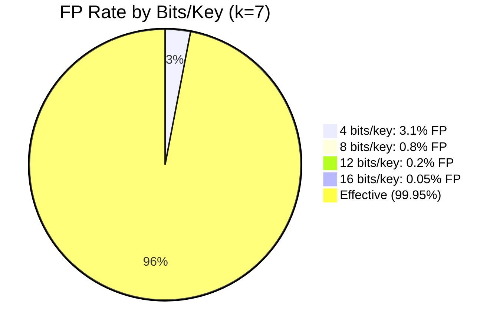
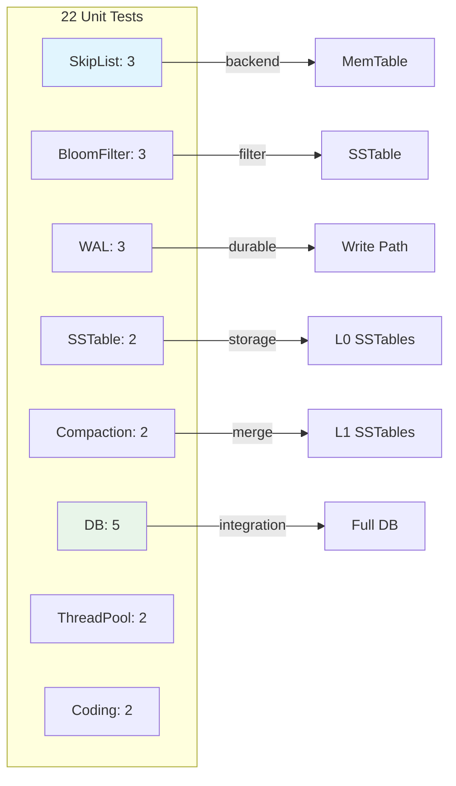

<p align="center">
  
  
  
  
</p>

<h1 align="center">🗄️ MiniKV</h1>

<p align="center">
  <b>Embedded LSM-Tree Key-Value Storage Engine</b><br/>
  <i>WAL · Bloom Filter · SSTable · Compaction — built from scratch in C++17</i>
</p>

---

## Overview

MiniKV is a **from-scratch implementation** of the core architecture behind LevelDB and RocksDB — the LSM-Tree (Log-Structured Merge-Tree). It's designed as a drop-in storage engine for applications needing fast writes with ordered key lookups.

### Write Path



### Read Path



### LSM-Tree Architecture

```mermaid
graph TB
    subgraph "Memory"
        WT[Write Thread] --> ML[MemTable<br/>SkipList]
    end

    subgraph "Disk"
        ML -->|flush| L0[L0 SSTables<br/>overlapping]
        L0 -->|compact| L1[L1 SSTables<br/>non-overlapping]
        L1 -->|compact| L2[L2 SSTables<br/>larger]
    end

    subgraph "WAL"
        WT --> WAL[Write-Ahead Log<br/>append-only]
    end

    style ML fill:#e1f5fe
    style L0 fill:#f3e5f5
    style L1 fill:#e8f5e9
    style L2 fill:#fff3e0
    style WAL fill:#fce4ec
```

---

## Core Concepts

| Component | What It Does |
|-----------|-------------|
| **MemTable** | In-memory sorted buffer (SkipList). Writes go here first. |
| **WAL** | Write-Ahead Log. Guarantees durability on crash. |
| **SSTable** | Sorted String Table. Immutable on-disk sorted files. |
| **Bloom Filter** | Probabilistic structure: "definitely not in this SSTable" |
| **Compaction** | Merges SSTables to reclaim space and reduce read levels. |
| **Skip List** | Probabilistic sorted structure used as MemTable backend. |

---

## Quick Start

```bash
# Clone
git clone https://github.com/Thezx-a/MiniKV.git
cd MiniKV

# Build & Test
cmake -B build -G Ninja -DCMAKE_BUILD_TYPE=Release \
  -DENABLE_TESTS=ON -DCMAKE_CXX_COMPILER=g++-12
cmake --build build -j$(nproc)
ctest --test-dir build --output-on-failure
```

### Use as a Library

```cpp
#include <minikv/db.h>

minikv::Options opts;
opts.create_if_missing = true;
minikv::DB* db;
minikv::DB::Open(opts, "/tmp/mydb", &db);

db->Put("key", "value");
std::string val;
db->Get("key", &val);  // val == "value"

delete db;
```

---

## Project Structure

```
MiniKV/
├── include/minikv/          Public API headers
│   ├── db.h                 DB open/put/get/delete
│   ├── options.h            Configuration
│   ├── comparator.h         Key comparison
│   └── write_batch.h        Atomic batch writes
├── src/
│   ├── db/                  DB implementation
│   ├── core/                LSM-Tree internals
│   │   ├── skiplist.h       MemTable backend
│   │   ├── wal.h            Write-Ahead Log
│   │   ├── sstable.h        SSTable reader/writer
│   │   ├── compaction.h     Merge logic
│   │   └── bloom.h          Bloom filter
│   ├── table/               Table operations
│   └── utils/               Utilities
│       ├── coding.h         Varint encoding
│       ├── crc32.h          Checksums
│       ├── hash.h           Hash functions
│       ├── lru_cache.h      LRU block cache
│       └── thread_pool.h    Async compaction
├── tests/                   22 unit tests
├── benches/                 Benchmarks
├── client/                  Python asyncio client
├── docker/                  Docker deployment
└── docs/                    Design documentation
```

---

## Bloom Filter Efficiency



| Bits/Key | FP Rate | Memory per 1M keys |
|----------|---------|-------------------|
| 4 | 3.1% | 500 KB |
| 8 | 0.8% | 1 MB |
| 12 | 0.2% | 1.5 MB |
| 16 | 0.05% | 2 MB |

---

## Tests



| Module | Tests | What's Verified |
|--------|-------|-----------------|
| SkipList | 3 | Insert, iterator, memory accounting |
| BloomFilter | 3 | FP rate, serialization, integration |
| WAL | 3 | Append, recovery, truncate |
| SSTable | 2 | Build, lookup |
| Compaction | 2 | L0→L1 merge, tombstone removal |
| DB | 5 | Put/Get, delete, batch, reopen, crash recovery |
| ThreadPool | 2 | Concurrent tasks, shutdown |
| Coding | 2 | Varint, fixed32 |

---

## Tech Stack

`C++17` `CMake` `Ninja` `Epoll` `Google Test` `Python asyncio`

---

## License

[MIT](LICENSE)
